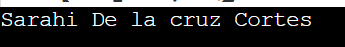

# Ejercicio de laboratorio 1 - Apertura, compilación y ejecución de su primer programa

## 🛠️ Instrucciones

1. Inicie el editor de código de su preferencia (ej. VS Code) y configurelo para escribir y compilar código en C++.
2. Escriba un programa que imprima su nombre en el archivo llamado lab1ejerc1.cpp.
3. Compila el programa.
4. Ejecuta el programa y añade el resultado en el apartado de \\**Resultado\\**

## ✅ Resultado
