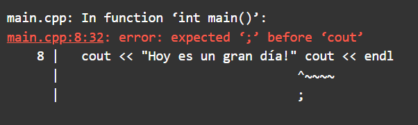
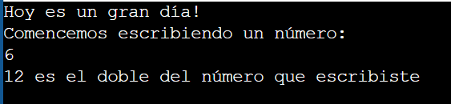

# Ejercicio de laboratorio 2 - Compilar un programa con un error de sintaxis

## 🛠️ Instrucciones

1. Revisa el programa del archivo denominado lab1ejerc2.cpp.
2. Compilar el programa. Aquí tenemos nuestro primer ejemplo de los muchos errores de sintaxis que sin duda encontrará durante el curso. El mensaje de error que recibe puede ser diferente según el sistema que esté utilizando, pero el compilador insiste en que falta un punto y coma en alguna parte. Desafortunadamente, donde el mensaje indica que el problema existe y donde realmente ocurre el problema puede haber dos lugares diferentes. Para corregir el problema, coloque un punto y coma después de la línea cout << "Hoy es un gran día!". La mayoría de los errores de sintaxis no son tan fáciles de detectar y corregir como este.
3. Vuelva a compilar el programa y, cuando no tenga errores de sintaxis, ejecute el programa. Registre la salida.
4. Intenta ejecutarlo con diferentes números. Graba tu salida. \\**¿Sientes que estás obteniendo resultados válidos?**\\

## ✅ Resultado

Sin corregir

Corregido

